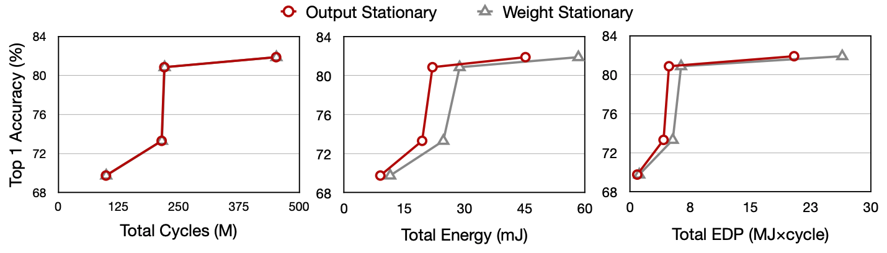
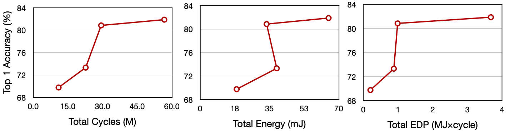
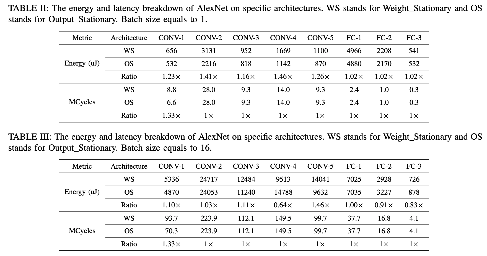
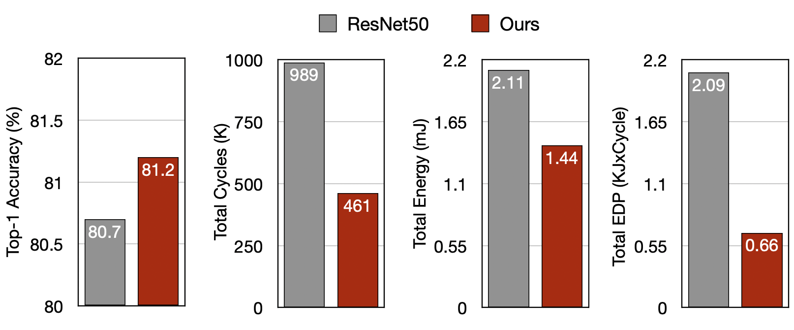

# 6.5930 Final Project: Efficiently Map DNN Models onto Existing Hardware Architecture

## Authors
Shang Yang (shangy@mit.edu)

Tianyuan Zhang (tianyuan@mit.edu)

Muyang Li (muyangli@mit.edu)

## Overview

This project aims to benchmark and evaluate existing Convolutional Neural Networks (CNNs) on three hardware architectures. We focus on understanding the interplay between CNN structures and architectural features to identify bottlenecks that affect efficiency and accuracy. Through comparative analysis and optimization techniques, we further improve the model’s efficiency-accuracy trade-off curves, via manual model architectural optimization. Specifically, we endeavor to uncover design principles that ensure computational efficiency (latency and energy consumption) without sacrificing accuracy. Anticipated outcomes include insights into optimal model dimensions and configurations, alongside a methodology to balance accuracy against efficiency constraints. Finally, this investigation may even inspire the design of edge computing architectures, setting new precedents for the integration of deep learning technologies within resource-constrained environments.

## Installation and Usage

### Model Training and Accuracy Evaluation

We used PyTorch for the experiments and verification regarding the models' accuracy. The base models we used in this project including the MobileNet, ResNet family, and DenseNet family. 

The instructions for accuracy evaluation can be found as below. 

```shell
python3 accuracy_eval/train.py --exp_name $EXP_NAME --lr $LEARNING_RATE --model_name $MODEL_NAME
```

where `$EXP_NAME` is used to create experiment directory, `$LEARNING_RATE` is your learning rate, and `$MODEL_NAME` is your network, such as `resnet50`.

### Energy and Latency Measurements with Hardware Simulation

We based our efficiency evaluation on the docker container equipped with pre-built Timeloop and Accelegy. We also utilized the PyTorch2Timeloop tool to seamlessly convert PyTorch models to layerwise breakdown workloads for simulation purposes.

To reproduce the efficiency evaluation results, please first pull the docker first to update the container, and then start with `docker-compose up`. 

```
cd <your-git-repo-for-final-project>
export DOCKER_ARCH=<your arch amd64 or arm64>
docker-compose pull
docker-compose up
```

After launching the docker, please follow the instructions here for the simulation results.

```shell
# First export layer shape pickle
python3 accuracy_eva/export_cnn_shapes.py --output_path $PATH_TO_SAVE_PKL --model_name $MODEL_NAME

# Please put the pickle in the same directory of `workspace/final-project`
# Second construct the workloads for simulation
python3 workspace/final-project/example_designs/scripts/construct_workloads2.py $PKL_NAME_WITHOUT_SUFFIX

ARCH=eyeriss_like # or `simple_output_stationary` or `simple_output_stationary`

rm -r example_designs/ARCH/outputs
python3 run_example_designs.py --architecture $ARCH --problem $PKL_NAME_WITHOUT_SUFFIX
python3 summarize_result.py --logs example_designs/$ARCH/outputs
```

## Results

We only listed part of our results here. Please refer to our project final report for more results.

### Evaluation of ResNet Models on simple weight/output stationary architecture


### Evaluation of ResNet Models on Eyeriss


### Efficiency Ablation

We also broke down the layerwise energy / latency cost of AlexNet on simple weight/output stationary architecture for detailed analysis. Generally, we found that although the output stationary is more efficient on most of the layers, when the weights are relatively large, or the batch size is large (kernel reuse opportunities), the weight stationary designs can achieve better energy efficiency.



### Model Optimization

We also optimized ResNet-50 model for more efficient mapping to Eyeriss-like architecture. Through shrinking the channel dimension, we achieved better energy-efficiency trade-offs compared to original ResNet-50.


